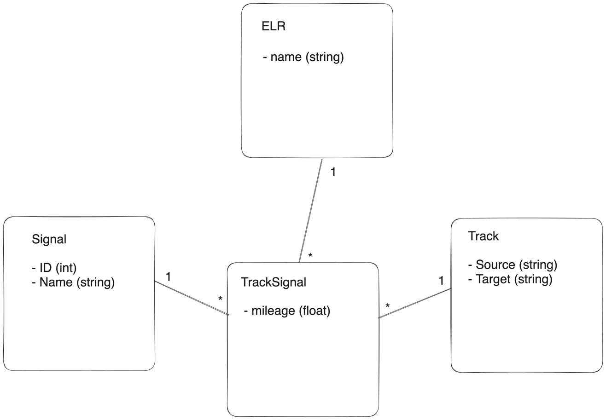

# Setup

There are two docker containers:
- service (railway-signal-service) backend
- postgres database

To run
`docker compose up -d --build service`

To stop
`docker compose down`

# Data Model



# APIs

## Signals

```
GET /signals
GET /signals/1234

POST /signals
{
  "id": 1234,
  "name": "signal"
}

PUT /signals/1234
{
  "name": "new signal name"
}

DELETE /signals/1234
```

 ## Tracks

 ```
GET /tracks
GET /tracks/1234

POST /tracks
{
  "id": 1234,
  "source": "home",
  "target": "work"
}

PUT /tracks/1234
{
  "id": 1234,
  "source": "school",
  "target": "shop"
}

DELETE /tracks/1234
```

## Incomplete
- Unit tests for database package
  - Either mock go-pg or use an in memory postgres solution like https://github.com/zonkyio/embedded-postgres-binaries
- Migrations
  - Do versioned migrations after the initial schema - https://github.com/go-pg/migrations looks like a good choice
